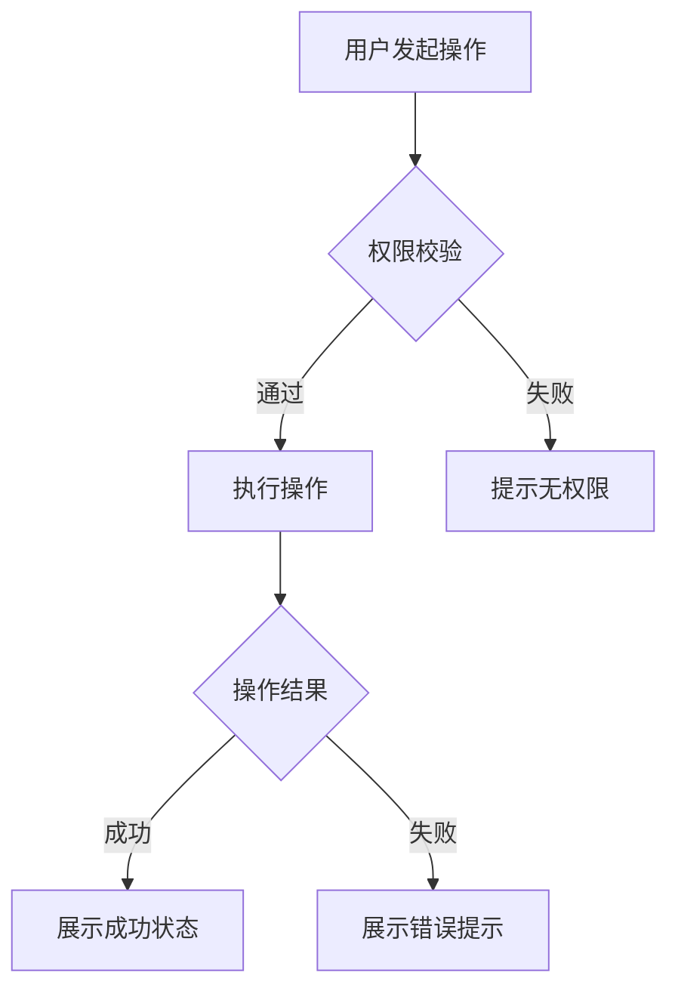

# PRD Brainstorm

通过多轮对话彻底探索需求，将确认内容增量写入草稿文件。结束时引导 PM 运行 `/prd:generate` 生成正式文档。

## Checklist

1. **判断需求类型** — 单个需求 or 多需求合并版本
2. **探索项目背景** — grep 关键词检索 `projects/`，读最相关的 1～3 个近期文件
3. **多轮追问** — 按固定大方向逐一聊透，每个方向未聊透不推进
4. **Mermaid 确认** — 流程梳理完后画图让 PM 确认；PM 随时可主动要求画图
5. **Checkpoint 写草稿** — 每个方向完成后写入 draft 文件
6. **结束引导** — 提示 PM 运行 `/prd:generate`

---

## 草稿文件规范

所有草稿保存在 `projects/.drafts/`，目录不存在时自动创建。

### 单个需求

```
projects/.drafts/[功能名]-draft.md
projects/.drafts/[功能名]-log.md
```

### 多需求合并版本

```
projects/.drafts/[版本名]-draft.md
projects/.drafts/[版本名]-log.md
```

### draft.md 结构（单需求）

```markdown
# [功能名] 需求草稿
> 最后更新：Checkpoint N — [当前阶段]

## ✅ 已确认

### 一、业务背景与价值点
[内容]

### 二、目标与范围
[内容]

### 三、目标用户
[内容]

### 四、流程
[Mermaid 流程图 + 文字说明]

### 五、产品/交互逻辑
[内容]

### 六、异常流程与边界条件
[内容]

### 七、验收标准
[内容]

### 八、数据与埋点需求
[内容]

## ❓ 待确认
- [ ] [问题描述]（第N轮，PM 暂未回答）

## 💡 关键决策
- [决策内容]，原因：[PM 说明的理由]
```

### draft.md 结构（多需求合并版本）

```markdown
# [版本名] 需求草稿
> 最后更新：Checkpoint N

## 需求清单
- [ ] 需求A：[简述]
- [x] 需求B：[简述]（追问完成）
- [ ] 需求C：[简述]

---

## 需求A

### ✅ 已确认
...

### ❓ 待确认
...

### 💡 关键决策
...

---

## 需求B

### ✅ 已确认
...
```

### log.md 结构（仅追加，AI 不读）

```markdown
## [日期] Checkpoint N — [阶段名]
- 确认：[内容]
- 修改：[原内容] → [新内容]，原因：[说明]
```

---

## Step 1: 判断需求类型

开场一句话：

> "请描述这次的需求，如果有多个功能点可以一起说，我会帮你整理。有 Axure/Figma 原型截图可以直接粘贴（`Cmd+V`）。"

收到后判断：

- **单个需求**：直接进 Step 2
- **多个独立小需求合并为一个版本**：
  1. 列出所有需求，逐一确认范围和命名
  2. 确认版本名称
  3. 按需求逐个走 Step 3～5，每个需求完成追问后标记 `[x]`
  4. 所有需求完成后统一进 Step 6
- **需求范围过大（横跨多个独立子系统）**：
  > "这个需求包含多个相互独立的功能，建议分开写 PRD。你希望先从哪个开始？"

---

## Step 2: 探索项目背景

在开始追问前，主动检索背景：

1. 用 Grep 对 `projects/` 目录按功能关键词搜索
2. 按相关性 + 文件修改时间排序，取最相关的 **1～3 个近期文件**读入
3. 不做全目录读取，不读 `.drafts/` 目录

如有相关历史文档，追问时主动引用，避免重复询问已知内容。

---

## Step 3: 多轮追问

**核心原则：每个方向必须聊透才能推进。宁可多问，不要少问。**

### 固定推进顺序

1. **业务背景 + 需求来源** — 为什么要做这个？用户痛点是什么？
2. **目标用户 + 用户故事** — 谁在用？在什么场景下用？要完成什么目标？
3. **目标与范围** — 要做什么？明确不做什么？
4. **核心流程** — 完整的用户操作路径是什么？ → 完成后触发 Mermaid（见 Step 4）
5. **交互逻辑** — 每个需求点的具体规则、生效版本、约束条件
6. **边界场景 + 异常处理** — 超时、数据为空、权限不足、并发怎么处理？
7. **验收标准 + 埋点** — 怎么验收？需要哪些埋点？

### 追问规则

- 每次只问一个问题，优先用选择题
- 收到原型截图时，立即分析提取交互逻辑，基于截图继续追问
- 必要时主动邀请：> "这里的交互逻辑还不够清晰，能补一张截图吗？"
- 某方向关键问题未获明确答复时，不推进到下一方向
- 如需视觉伴侣（布局/流程细节文字无法描述清楚时），单独发送邀请消息：
  > "有些交互细节用文字不太好描述，我可以在浏览器里展示流程图或布局对比来辅助确认。需要开启吗？（需要打开本地 URL）"

### 重点追问方向

- **逻辑合理性**：这个设计合理吗？有没有更简单的实现路径？
- **逻辑完整性**：A 触发后 B 怎么处理？边界情况是什么？存量数据怎么处理？
- **需求完整性**：这个场景覆盖了吗？有没有遗漏的用户路径？
- **生效版本**：每个需求点适用哪些版本（基础版/专业版/商务版）？
- **异常场景**：超时、数据为空、权限不足、并发时怎么处理？
- **数据与埋点**：哪些操作需要埋点，指标是什么？

---

## Step 4: Mermaid 流程图确认

### 触发时机

- **核心流程**（Step 3 第4步）梳理完成后，**必须**画出流程图让 PM 确认
- **交互逻辑**中出现复杂分支或多状态流转时，主动画图确认
- **PM 随时主动要求**（"画个流程图"、"用图表示一下"等），立即响应

### 操作流程

1. 生成 Mermaid 图并展示
2. 询问 PM 是否确认：> "这个流程图是否准确？有需要调整的地方吗？"
3. PM 确认后，写入 `draft.md` 对应章节
4. 继续追问

### Mermaid 规范

- 流程图使用 `flowchart TD`
- 交互状态图使用 `stateDiagram-v2`
- 保持简洁，节点文字不超过 20 字

示例：


---

## Step 5: Checkpoint 写草稿

### 触发时机（按话题边界）

| 阶段完成 | Checkpoint |
|---|---|
| 背景 + 目标范围确认 | Checkpoint 1 |
| 核心流程确认（含 Mermaid）| Checkpoint 2 |
| 交互逻辑每个需求点确认 | Checkpoint 3（可多次）|
| 异常场景 + 验收标准确认 | Checkpoint 4（草稿完整）|

### 写入规则

**`draft.md`（覆盖更新，保持最新状态）：**
- 将本阶段确认内容写入对应章节的 `✅ 已确认` 区
- 已答的待确认项移入已确认区
- 若 PM 推翻之前决定：旧内容加 ~~删除线~~ 并注明，新内容追加
- 写入后告知 PM：`"[阶段名]已存档，继续聊[下一方向]。"`

**`log.md`（仅追加）：**
- 记录本次 checkpoint 确认的要点和变更
- AI 后续不再读取此文件

---

## Step 6: 结束引导

所有方向聊透、Checkpoint 4 完成后：

> "需求草稿已完成，保存在 `projects/.drafts/[功能名]-draft.md`。
> 确认内容无误后，运行 `/prd:generate` 生成正式文档。"

多需求版本：

> "所有需求的草稿已完成，保存在 `projects/.drafts/[版本名]-draft.md`。
> 运行 `/prd:generate` 将合并生成完整版本 PRD。"
